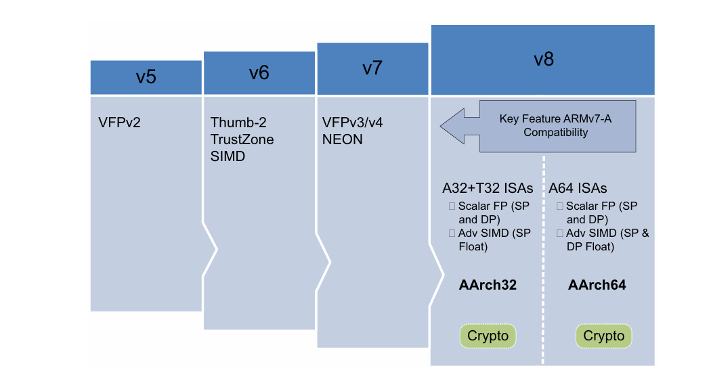
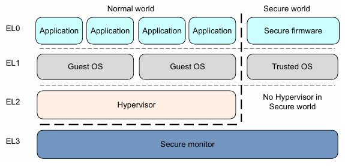
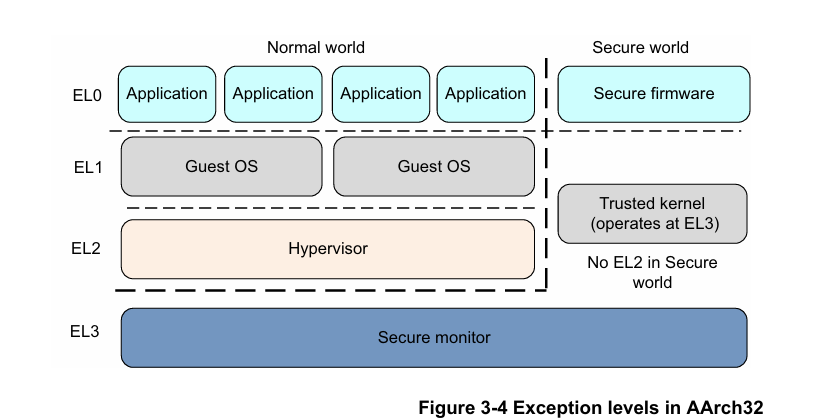

# Fundamentals

The name ARMv8 is used to describe the overall architecture, which now includes both 32-bit execution and 64-bit execution. 

## 2 Worlds, 4 Levels

2 worlds: Normal & Secure, 4 exception levels: EL0~3

- EL0 Applications

- EL1 OSes: Linux, Android, ...
- EL2 Hypervisors: virtual machine manager
- EL3 Secure monitor: gateway between 2 worlds

> Note: No virtualization support for secure world

### Switch Exception levels

- An exception causes a change of program flow. Execution of an exception handler starts:
  - IRQ and FIQ
  - Memory system aborts
  - Undefined instructions
  - System calls
  - Secure monitor or hypervisor traps
- Ending exception handling and returning to the previous Exception level by `ERET` 

> Note: 
>
> - Returning from an exception cannot move to a higher Exception level
> - No exception handling at EL0
> - World can change with a change of Exception level

## 2 Execution States

A64 instruction set for AArch64 state, A32 or T32 (Thumb) instruction set AArch32 state. The exception level of A32 is slightly different:

In AArch32 state, Trusted OS software executes in Secure EL3, and in AArch64 state it  primarily executes in Secure EL1.

### Switch execution state

You can only change execution state by changing Exception level:

- AArch64 -> AArch32 requires higher -> lower Exception level (`ERET`)
- AArch32 -> AArch64 requires lower -> higher Exception level (exception/interrupt)

> Note: Code at EL3 cannot take an exception to a higher level, so cannot change execution state, except by going through a reset.

