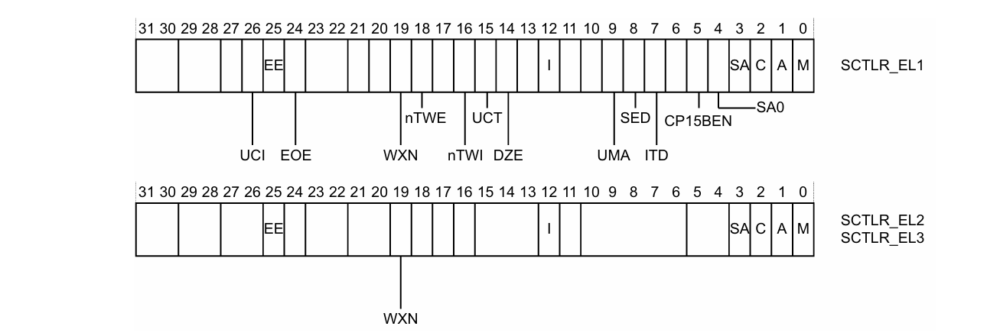
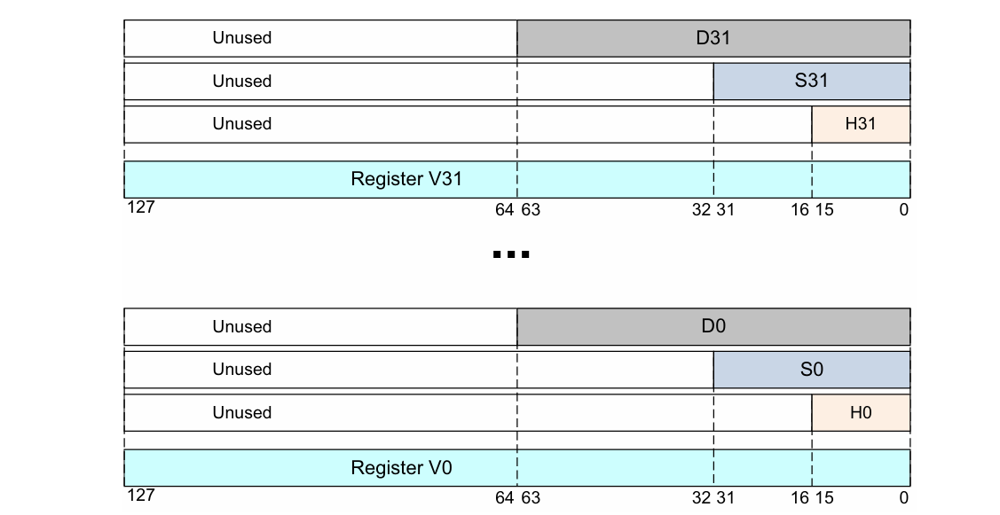
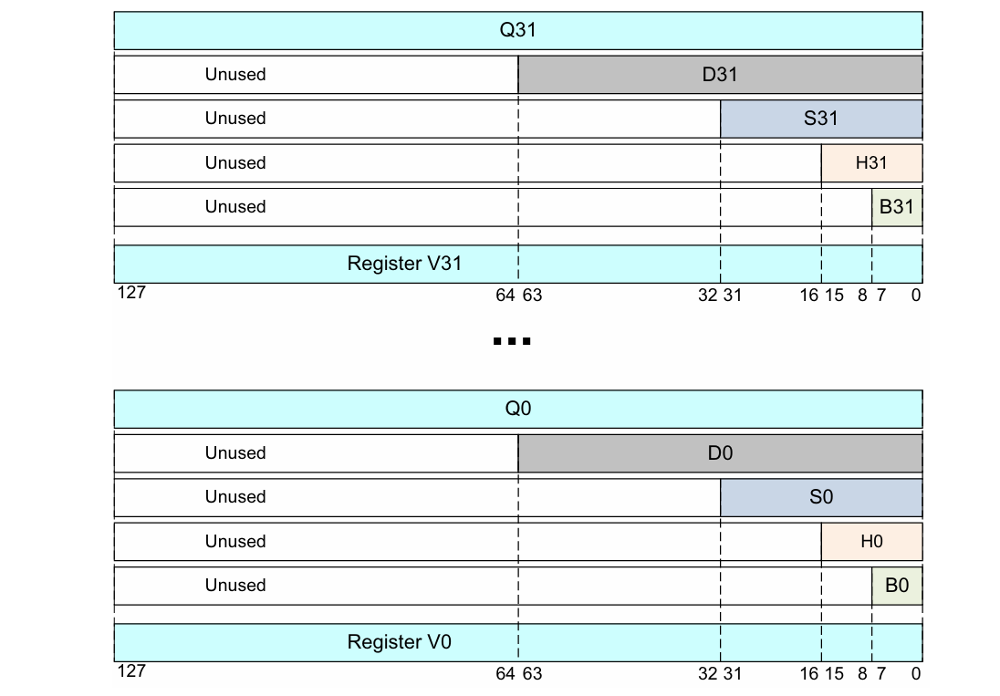
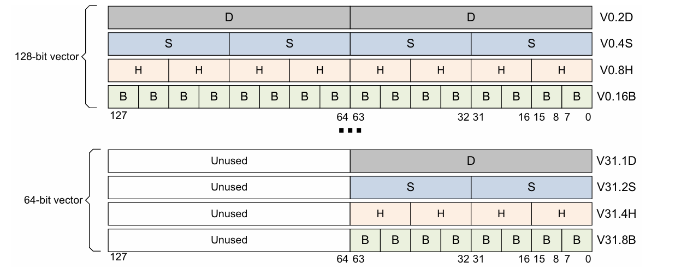
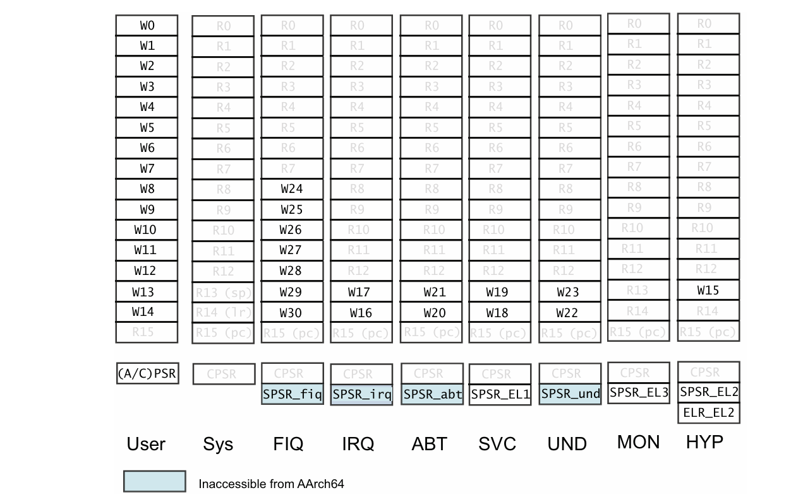
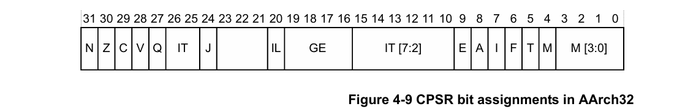

# ARMv8 Registers

## General Registers

31 × 64-bit general-purpose registers (`X0`-`X30`) at all times and in all Exception levels. They also has a 32-bit (W0-W30) form.

## Special Registers


- `XZR` is 64 bits, `WZR` is the lower 32 bits, they are zero register: all writes are ignored and all reads return 0
- `SP` is 64bits, `WSP` is the lower 32 bits: Current stack pointer
- `PC` is 64 bits: Program counter

In AArch64, the exception return state is held in:

- `ELR` Exception Link Register holds the exception return address

- `SPSR` Saved Processor State Register

### SP

Each Exception level has its own stack pointer, `SP_ELn`. By default, taking an exception selects the stack pointer for the target  Exception level, `SP_ELn`. In AArch64, `SP_EL0` can be selected at any Exception level.

`SP` cannot be referenced by most instructions. However, some forms of arithmetic  instructions can:

```assembly
ADD SP, SP, #0x10  // Adjust SP to be 0x10 bytes before its current value
```

### PC

The `PC` is never accessible as a named register. Its use is implicit in certain instructions such as  PC-relative load and address generation. 

### SPSR

The `SPSR` holds the value of `PSTATE`  before taking an exception and is used to restore the value of `PSTATE` when executing an  exception return.


`N` - Negative result (N flag)<br>`Z` -  Zero result (Z) flag<br>`C` - Carry out (C flag)<br>`V` - Overflow (V flag)<br>`SS` - Indicates whether software step was enabled when an exception was taken<br>`IL` - Illegal Execution State. Shows the value of PSTATE.IL immediately before the exception was taken<br>`D` - Process state Debug mask<br>`A` - SError (System Error) mask<br>`I` - IRQ mask<br>`F` - FIQ mask<br>`M[4]` - Execution state that the exception was taken from. 0 indicates AArch64<br>`M[3:0]` - Mode or Exception level that an exception was taken from

 The core populates the SPSR when taking an exception. If the exception is taken in `ELn`,  then `SPSR_ELn` is used

## State Register

The Processor State, or PSTATE fields in AArch64. When returning from an exception by executing the `ERET` , the `SPSR_ELn` is copied into PSTATE. The `PSTATE.{N, Z, C, V}` fields can be accessed at `EL0`. All other fields can be executed at `EL1` or higher.

`N` - Negative condition flag <br>
`Z` - Zero condition flag <br>
`C` - Carry condition flag <br>
`V` - oVerflow condition flag <br>
`D` - Debug mask bit <br>
`A` - SError mask bit <br>
`I` - IRQ mask bit <br>
`F` - FIQ mask bit <br>
`SS` - Software Step bit <br>
`IL` - Illegal execution state bit <br>
`EL (2)` - Exception level <br>
`nRW` - Execution state. 0 = 64-bit; 1 = 32-bit <br>
`SP` - Stack Pointer selector. 0 = `SP_EL0`; 1 = `SP_ELn`

## System Registers

In AArch64, system configuration is controlled through system registers, the name of a register tells you the lowest Exception level that it can be accessed from.

```assembly
MRS  x0, TTBR0_EL1 // Move TTBR0_EL1 into x0
MSR  TTBR0_EL1, x0  // Move x0 into TTBR0_EL1
```

For a complete list of system registers, see *ARM Architecture Reference Manual - ARMv8, for  ARMv8-A architecture profile*.

### SCTLR

The System Control Register controls standard memory, system  facilities and provides status information for functions that are implemented in the core.



`UCI` - When set, enables `EL0` access in AArch64 for `DC CVAU`, `DC CIVAC`, `DC CVAC`, and  `IC IVAU` instructions<br>`EE` - Exception endianness. 0 - Little endian; 1 - Big endian<br>`EOE` - Endianness of explicit data accesses at EL0. 0 - Little endian; 1 - Big endian<br>`WXN` - Write permission implies XN (eXecute Never). 0 - Not forced to `XN`; 1 -  Forced to `XN`<br>`nTWE` - Not trap WFE. 1 - `WFE` are executed as normal<br>`nTWI` - Not trap WFI. 1 - `WFI` are executed as normal<br>`UCT` - When set, enables EL0 access in AArch64 to the CTR_EL0 register<br>`DZE` - Access to `DC ZVA` instruction at EL0. 0 - prohibited; 1 - allowed<br>`I` - Enable bit for instruction caches at `EL0` and  `EL1`<br>`UMA` - User Mask Access. Controls access to interrupt masks from `EL0` in AArch64<br>`SED` - `SETEND` Disable. Disables `SETEND` instructions at EL0 in AArch32<br>`ITD` - `IT` Disable. 1 - The `IT` is a 16-bit instruction. Only another 16-bit  instruction, or the first half of a 32-bit instruction can follow<br>`CP15BEN` - Enable bit for the AArch32 `DMB`, `DSB`, and `ISB` barrier operations<br>`SA0` - Stack Alignment Check Enable for `EL0`<br>`SA` - Stack Alignment Check Enable<br>`C` - Enable bit for data caches at EL0 and EL1<br>`A` - Alignment check enable bit<br>`M` - Enable the MMU

For `EL3`, `EL2` and  `EL1`, the relevant register of `SCTLR_ELn.EE` sets the endianness. The additional bit at `EL1`,  `SCTLR_EL1.E0E` controls the data endian setting for `EL0`. In AArch64, data  accesses can be LE or BE, while **instruction fetches are always LE**.

## NEON and FP registers

 ARMv8 also has 32 128-bit floating-point and scalar registers labeled `V0`-`V31`

> Note: The AArch64 V16-V31 FP and NEON registers are not accessible from AArch32

### Floating-point



```assembly
FADD Sd, Sn, Sm  // Single-precision add
FADD Dd, Dn, Dm  // Double-precision add
FCVT Sd, Hn  // convert half-precision to single-precision
FCVT Dd, Hn  // convert half-precision to double-precision
FCVT Hd, Sn  // convert single-precision to half-precision
FCVT Hd, Dn  // convert double-precision to half-precision
```

### Scalar

### Vector

Vectors can be 64-bits wide with one or more elements or 128-bits wide with two or more elements:



For 32-bit vectors this time, with 4 lanes:

```assembly
ADD Vd.4S, Vn.4S, Vm.4S
```

## Registers Mapping

Being virtually identical to ARMv7 means AArch32 must match ARMv7 privilege levels, 32-bit general-purpose registers:



>  Note: When switch from AArch64 to AArch32, the top 32 bits of the `ELR_ELn` are all zero

At AArch32, we can use `CPSR` from ARMv7:



And here are extra fields in `PSTATE` corresponding to the ARMv7 `CPSR` bits in AArch32:

`Q` - Cumulative saturation (sticky) flag<br>`GE(4)` - Greater than or Equal flags<br>`IT(8)` - If-Then execution bits<br>`J` - J bit<br>`T` - T32 bit<br>`E` - Endianness bit<br>`M` - Mode field

At AArch32, software, for example OS or Hypervisor, can map floating-point and Advanced SIMD registers to AArch64 FP and SIMD registers. This is done by allowing the floating-point and NEON registers of an application or a virtual machine to be interpreted and modified by OS or Hypervisor.