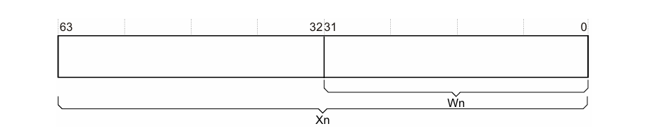
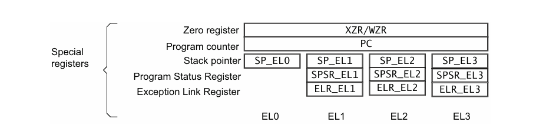
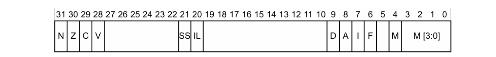

# ARMv8 Registers

## General Registers

31 × 64-bit general-purpose registers (`X0`-`X30`) at all times and in all Exception levels. They also has a 32-bit (W0-W30) form.

## Special registers



- `XZR` is 64 bits, `WZR` is the lower 32 bits, they are zero register: all writes are ignored and all reads return 0
- `SP` is 64bits, `WSP` is the lower 32 bits: Current stack pointer
- `PC` is 64 bits: Program counter

In AArch64, the exception return state is held in:

- `ELR` Exception Link Register holds the exception return address

- `SPSR` Saved Processor State Register

### SP

Each Exception level has its own stack pointer, `SP_ELn`. By default, taking an exception selects the stack pointer for the target  Exception level, `SP_ELn`. In AArch64, `SP_EL0` can be selected at any Exception level.

`SP` cannot be referenced by most instructions. However, some forms of arithmetic  instructions can:

```assembly
ADD SP, SP, #0x10  // Adjust SP to be 0x10 bytes before its current value
```

### PC

The `PC` is never accessible as a named register. Its use is implicit in certain instructions such as  PC-relative load and address generation. 

### SPSR

The `SPSR` holds the value of `PSTATE`  before taking an exception and is used to restore the value of `PSTATE` when executing an  exception return.



`N` - Negative result (N flag)<br>`Z` -  Zero result (Z) flag<br>`C` - Carry out (C flag)<br>`V` - Overflow (V flag)<br>`SS` - Indicates whether software step was enabled when an exception was taken<br>`IL` - Illegal Execution State. Shows the value of PSTATE.IL immediately before the exception was taken<br>`D` - Process state Debug mask<br>`A` - SError (System Error) mask<br>`I` - IRQ mask<br>`F` - FIQ mask<br>`M[4]` - Execution state that the exception was taken from. 0 indicates AArch64<br>`M[3:0]` - Mode or Exception level that an exception was taken from

 The core populates the SPSR when taking an exception. If the exception is taken in `ELn`,  then `SPSR_ELn` is used

## PSTATE

The Processor State, or PSTATE fields in AArch64. When returning from an exception by executing the `ERET` , the `SPSR_ELn` is copied into PSTATE. The `PSTATE.{N, Z, C, V}` fields can be accessed at `EL0`. All other fields can be executed at `EL1` or higher.

`N` - Negative condition flag <br>
`Z` - Zero condition flag <br>
`C` - Carry condition flag <br>
`V` - oVerflow condition flag <br>
`D` - Debug mask bit <br>
`A` - SError mask bit <br>
`I` - IRQ mask bit <br>
`F` - FIQ mask bit <br>
`SS` - Software Step bit <br>
`IL` - Illegal execution state bit <br>
`EL (2)` - Exception level <br>
`nRW` - Execution state. 0 = 64-bit; 1 = 32-bit <br>
`SP` - Stack Pointer selector. 0 = `SP_EL0`; 1 = `SP_ELn`