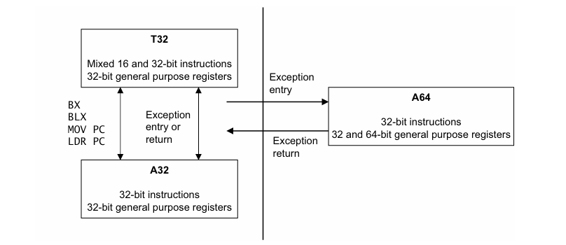
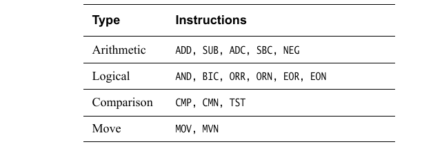
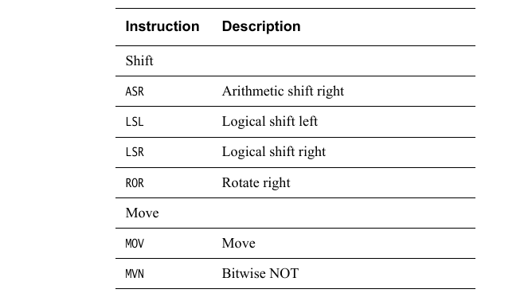
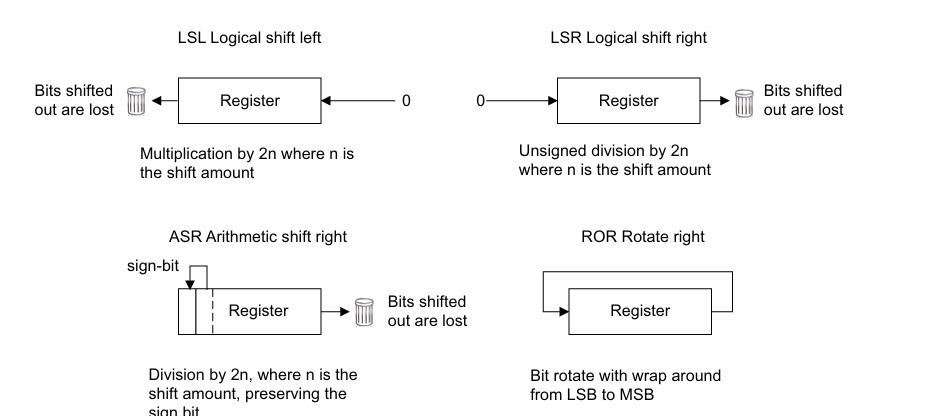

#  Instruction Sets

- A32 - AArch32 state - compatible with ARMv7
- T32 - AArch32 state - Thumb2
- A64 - AArch64 state - opcodes still 32 bits long

> Note: Where the `PC` is read by an instruction to compute a PC-relative address, then its  value is the address of that instruction. Unlike A32 and T32, there is no implied  offset of 4 or 8 bytes.



## Data processing instructions

### Arithmetic and logical operations



Some instructions also have an S suffix, indicating that the instruction sets flags:  `ADDS`, `SUBS`, `ADCS`, `SBCS`, `ANDS`, and `BICS`

`ADC` and `SBC` also use the carry condition flag as an input:

```assembly
ADC{S}: Rd = Rn + Rm + C
SBC{S}: Rd = Rn - Rm - 1 + C
```

```assembly
ADD W0, W1, W2, LSL #3   // W0 = W1 + (W2 << 3)
SUBS X0, X4, X3, ASR #2  // X0 = X4 - (X3 >> 2), set flags
MOV X0, X1               // Copy X1 to X0
CMP W3, W4               // Set flags based on W3 - W4
ADD W0, W5, #27          // W0 = W5 + 27
```

The logical operations operate on individual bits of the register. For example, to clear bit [11]  of register `X0`, use:

```assembly
MOV X1, #0x800
BIC X0, X0, X1
```

`ORN` and `EON` perform an `OR` or `EOR` respectively with a bitwise-NOT of the second operand.

### Multiply and divide instructions


There are multiply instructions that operate on 32-bit or 64-bit values and return a result of the  same size as the operands:

```assembly
MUL X0, X1, X2  // X0 = X1 * X2
```

Using  the `MADD` or `MSUB` instructions to add or subtract an accumulator value in a third source register:

```assembly
MADD X0, X1, X2, X3  // X0 = X3 + (X1 * X2)
MSUB X0, X1, X2, X3  // X0 = X3 - (X1 * X2)
```

`MNEG` negates the result:

```assembly
MNEG X0, X1, X2  // X0 = -(X1 * X2)
```

Additionally,  there are multiply instructions that produce a long result (e.g. 32bit * 32bit = 64bit). There are both signed and unsigned variants (`UMULL`, `SMULL`). There are also options to accumulate a value from another register (`UMADDL`, `SMADDL`) or to negate (`UMNEGL`, `SMNEGL`):

```assembly
SMADDL X0, W1, W2, X3  // X0 = X3 + (s64)W1 * (s64)W2
SMNEGL X0, W1, W2      // X0 = -((s64)W1 * (s64)W2)
SMSUBL X0, W1, W2, X3  // X0 = X3 - (s64)W1 * (s64)W2
SMULH  X0, X1, X2      // X0 = ((s128)X1 * (s128)X2) >> 64
SMULL  X0, W1, W2      // X0 = (s64)W1 * (s64)W2

UMADDL X0, W1, W2, X3  // X0 = X3 + (u64)W1 * (u64)W2
UMNEGL ...
UMSUBL ...
UMULH  ...
UMULL  ...
```

signed and unsigned division of 32-bit and 64-bit  sized values:

```assembly
UDIV W0, W1, W2  // W0 = W1 / W2 (unsigned, 32-bit divide)
SDIV X0, X1, X2  // X0 = X1 / X2 (signed, 64-bit divide)
```

> Note division by zero and overflow is not trapped
>
> - Any integer division by zero returns zero
> - Overflow can only occur in SDIV, INT_MIN / -1 returns INT_MIN

### Shift operations





The register can be 32-bit or 64-bit, The amount to be shifted can be  specified either as an immediate, that is up to register size minus one, or by a register.

```assembly
ASR X0, X1, #5  // X0 = (s64)X1 >> 5
ASR W0, W1, W2  // W0 = (s64)W1 >> (u8)W2[4:0]
LSL W0, W1, #5  // W0 = (u32)W1 << 5
LSR X0, X1, X2  // X0 = (u32)X1 >> (u8)X2[5:0]
```
